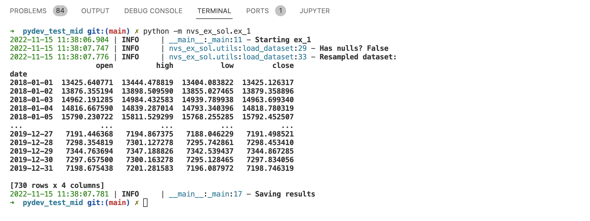
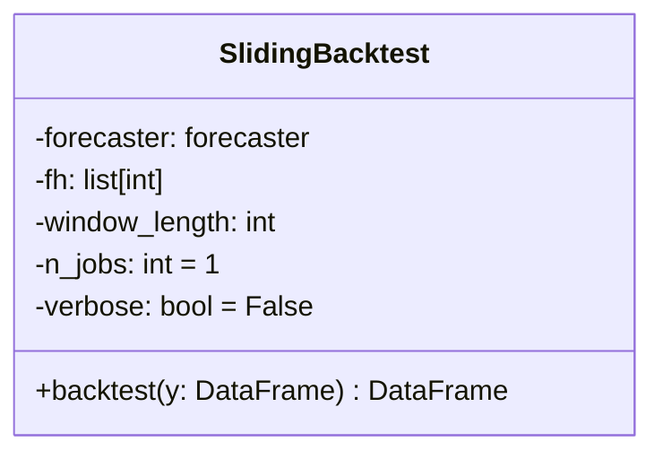
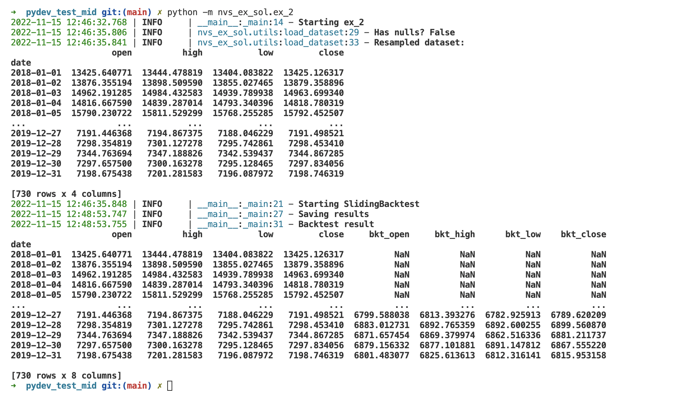
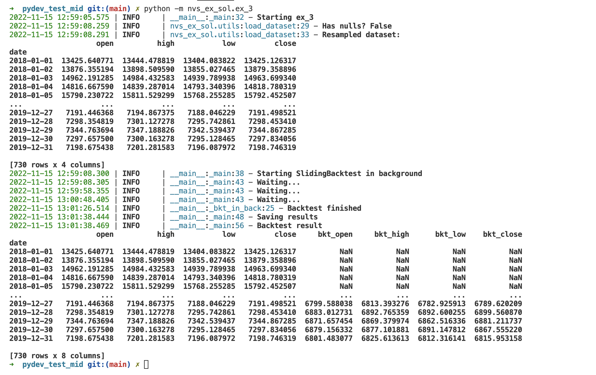
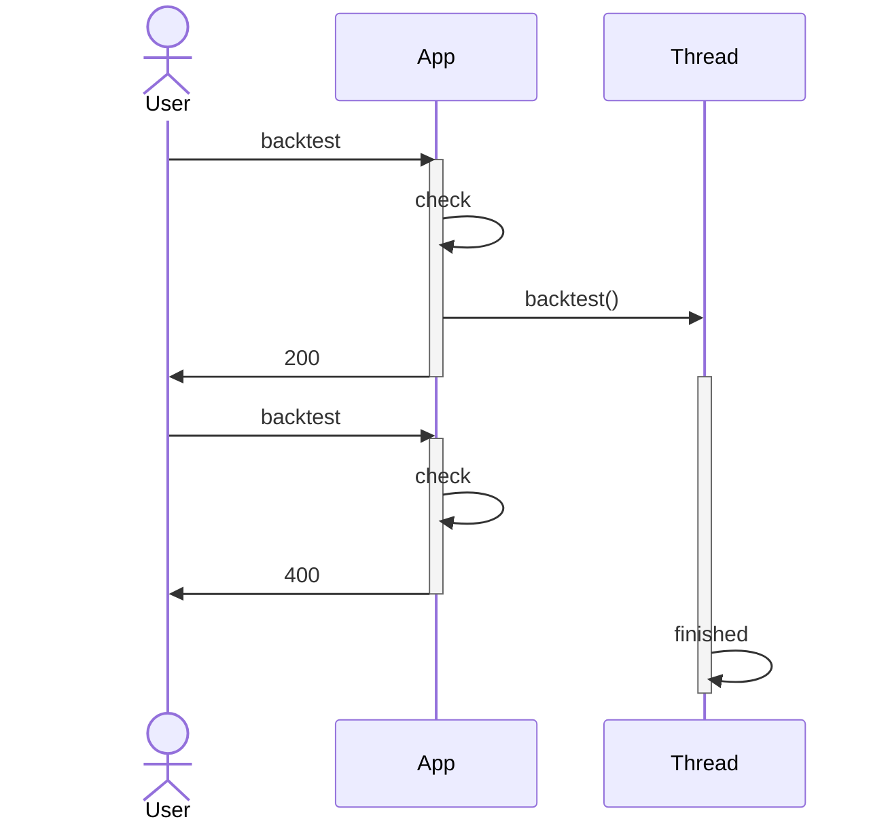
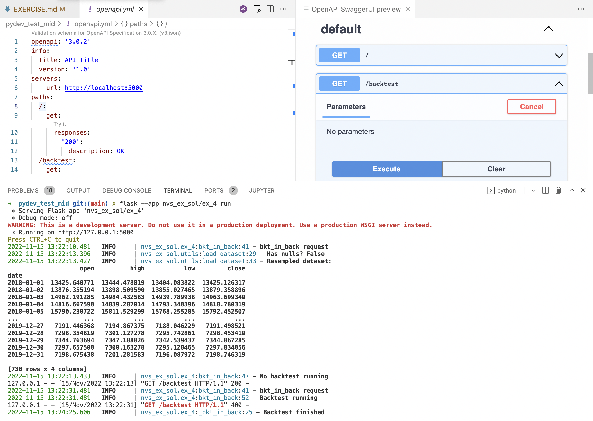

# Python Developer Test

## Introduction

The test is composed of 4 exercises.

In `ex_1.py` you have to load data from some `.csv` files.

In `ex_2.py` you will create the `SlidingBacktest` which will do a backtest in parallel on the loaded data.

Exercises 3 and 4 are very similar. In `ex_3.py` you will have to execute `SlidingBacktest` in the background, called from a script. And in `ex_4.py` you will trigger the backtest from a Flask app.

This test is about 2-3 hours long.

## Project scaffold

This project includes:

* `assets/` - includes the `.csv` files with raw data
* `out/` - any output file shall be saved in here
* `nvs_ex/` - main Python package
* `pyproject.toml` - project dependencies (compatible with poetry)
* `Makefile` - to automate some tasks
* Basic project configuration files

## Requirements and setup

* Python >= 3.9
* Command line terminal
* Any IDE
* [Optional] Docker

Notice the project includes a `.devcontainer`. For this exercise it is advisable (but not mandatory) to develop use VSCode and Docker. Alternatively, you can also code in GitHub Codespaces.

If you prefer to develop out of a container, you will have to install the required software by your own.

## Recommended VSCode extensionns

We recommend you to install the following extensions:

* Remote Development (no needed with Codespaces) [(link)](https://marketplace.visualstudio.com/items?itemName=ms-vscode-remote.vscode-remote-extensionpack)
* Python [(link)](https://marketplace.visualstudio.com/items?itemName=ms-python.python)
* OpenAPI [(link)](https://marketplace.visualstudio.com/items?itemName=42Crunch.vscode-openapi)

## Solving the test

Complete the exercises as explained below, on a dedicated branch.

Once finished, push your code.

## Exercise 1: Data load

### Description

In this exercise you will have to load some data stored in two `.csv` files into one `pandas.DataFrame` object.

Please complete `nvs_ex/ex_1.py`. You will see that you have to implement the `load_data()` function in `nvs_ex/utils.py`.

### Expected result



### Tips

* The raw data is not daily, so it has to be resampled.
* The raw data is not sorted.
* Use the timestamp as index.

## Exercise 2: SlidingBacktest

### Description

In this exercise you will have to implement a sliding backtest. What is that? Imagine we have the following data:

| date       | value |
|------------|-------|
| 2022-01-01 | 10.0  |
| 2022-01-02 | 20.5  |
| 2022-01-03 | 10.5  |
| 2022-01-04 | 20.0  |
| 2022-01-05 | 15.5  |
| 2022-01-06 | 15.5  |
| 2022-01-07 | 15.0  |
| 2022-01-08 | 20.0  |

The sliding backtest algorithm will do (assuming a window length equal to 5):

1. Get the first 5 rows (from 2022-01-01 to 2022-01-05) and forecast for 2022-01-06.
1. Move the window one step, get 5 rows (from 2022-01-02 to 2022-01-06) and forecast for 2022-01-07.
1. Move the window one step, get 5 rows (from 2022-01-03 to 2022-01-07) and forecast for 2022-01-08.
1. ...

In this exercise you have to implement the `SlidingBacktest` class within `nvs_ex/forecasting/_bkt.py`. The image below defines the attributes and the methods.



The `nvs_ex/ex_2.py` script already has some code to call this class. You will only need to uncomment some lines:

```python
def _main():
    logger.info("Starting ex_2")

    # Load dataset
    y = load_dataset()

    # Do a backtest on the loaded dataset using SlidingBacktest
    # TODO: once implemented the class, uncomment the lines below
    # logger.info("Starting SlidingBacktest")
    # bkt = SlidingBacktest(forecaster=Prophet(), fh=[1], window_length=100, n_jobs=10)
    # y_pred = bkt.backtest(y)
```

 As depicted:

* We will use `sktime.Prophet` as a forecaster.
* `SlidingBacktest` attributes are initialed with some values (which should not be changed).

> **Important**
>
> The code in `backtest()` has to run in parallel.

### Expected result

It should be something like:



### Tips

* `sktime` package already includes `SlidingWindowSplitter`.

## Exercise 3: SlidingBacktest in background

`nvs_ex/ex_3.py` is similar to the previous exercise. Here you will have to run the backtest in background, and periodically check if it has finished.

### Expected result

It should be something like:



## Exercise 4: Flask app for SlidingBacktest

In `nvs_ex/ex_4.py` you have to create a Flask app to trigger the backtest via a REST web API.



The definition of the API is defined in `openapi.yaml`.

### Tips

* You are only requested to trigger the backtest.
* If backtest is already running, the app will return 400.
* Backtest result is not send through the API.
* Use OpenAPI VSCode extension (see image below).


